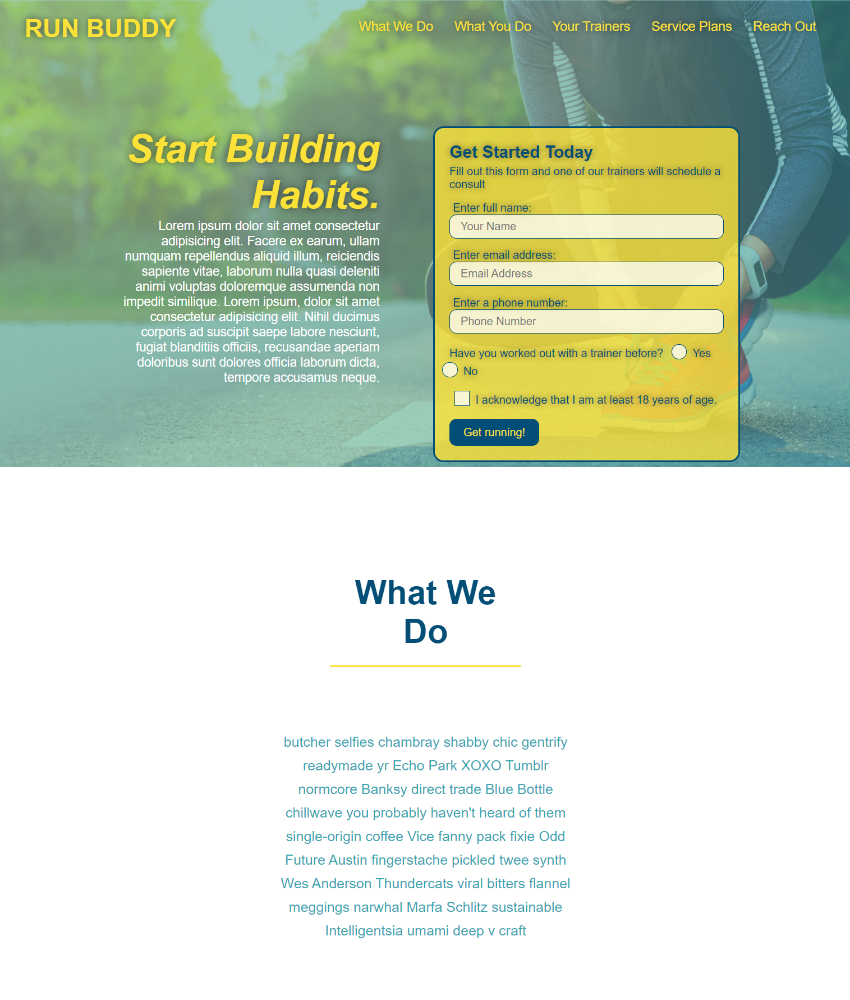

# Run Buddy

## Description
Website that offers fitness training services

Table of Contents |
-------------------|
[Usage](#Usage)
[Technologies](#Technologies)
[Screenshots](#Screenshots)
[Contributing](#Contributing)
[Author](#Author)
[Questions](#Questions)

 

## Usage

Website built with HTML and CSS. The application allows for users to view information about the fitness training services, reach out to set up consultation, view trainer profiles and well as contact information. The website is mobile responsive and allows for users to also view the privacy policy that is linked at the bottom of the page.

You can find the deployed link and the repository link below:

Deployed Link: [Deployed Link](https://cerafinn.github.io/run-buddy)

Repo Link: [Repo Link](https://github.com/cerafinn/run-buddy)

 

## Technologies

* HTML
* CSS

 

## Screenshots

## Contributing

If interested in contributing to the project, feel free to reach out. Contact information can be found in the Questions section.

 

## Author

Andaleeb Farooq: [:octocat:](https://github.com/cerafinn)

 

## Questions

If you have any questions or issues, feel free to reach out at: andaleeb.farooq@gmail.com.
You can also find more of my work on Github at [github link](https://github.com/cerafinn).